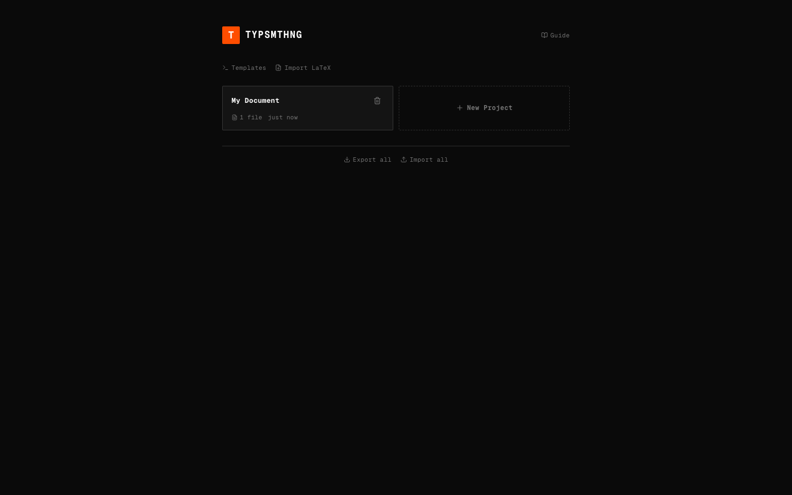
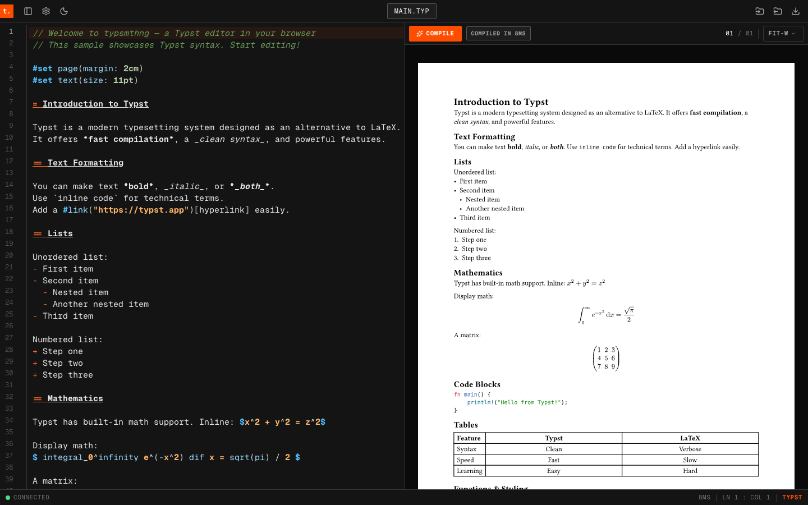

# typsmthng

A browser-native Typst editor with live preview, local-first project storage, and offline/PWA support.

## Why?
OpenAI bought Crixet recently, and rebranded it to Prism (which also collides with something I started, https://theprism.fyi in branding) and I was already a tad irked by the bloated Java-esque syntax heaviness of the LaTeX ecosystem for text, as much as I like it for formulaic presentation.

I had given Typst a try throughout the years, and even though I did not like the UX of their web editor, I really like the syntax and bundling. Now, they seem to have VSCode tooling, but I'm a Zed user. And I'd like this to be a tool anyone can use, so a web, local-only solution made the most sense.

## Features

- Live Typst compilation to SVG preview (WebAssembly, fully in-browser)
- Multi-file projects with file tree operations (create, rename, move, delete)
- Local persistence with IndexedDB
- Project import/export as `.zip`
- PDF export
- Vim mode, theme switching, and editor preferences (for the nerds)
- PWA installability (because mobile users need good support too) 

## Screenshots

Home (desktop):



Editor + live preview (desktop):



## Tech Stack

- React 19 + TypeScript
- Vite 8
- CodeMirror 6
- Zustand
- Typst WASM toolchain via `@myriaddreamin/typst.ts`
- Vitest + Testing Library

## Getting Started

### Prerequisites

- Bun `1.3+`
- Node.js `20.19+` or `22.12+` (required by Vite 8)

### Install

```bash
bun install
```

### Run locally

```bash
bun run dev
```

Open the URL printed by Vite (typically `http://localhost:5173`).

## Scripts

- `bun run dev` - start development server
- `bun run build` - type-check and create production build
- `bun run build:budget` - build and enforce initial JS preload budget
- `bun run preview` - preview production build locally
- `bun run lint` - run ESLint
- `bun run test` - run Vitest once
- `bun run test:watch` - run Vitest in watch mode

## Project Structure

- `src/components/` - UI components (editor, preview, layout, sidebar, settings)
- `src/stores/` - Zustand state stores
- `src/lib/` - compiler integration, project I/O, keybindings, helpers
- `src/test/` - unit/integration tests
- `public/` - static assets and PWA icons

## Build Output Notes

The app bundles Typst WASM artifacts, so production output includes large `.wasm` assets. This is expected for in-browser compilation.

## Contributing

1. Create a feature branch.
2. Make your changes.
3. Run:

```bash
bun run lint
bun run test
bun run build
```

4. Open a pull request. **(If you're vibecoding, kindly include your prompt as well.)**

## License

No license file is currently included in this repository.
